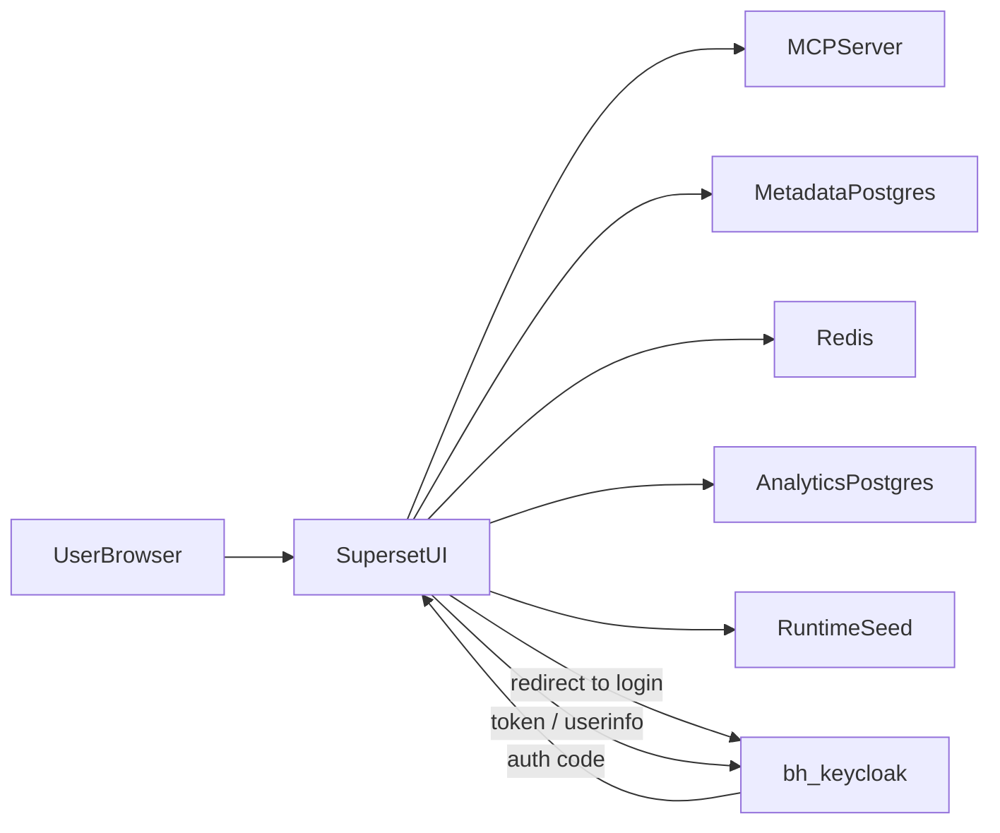

# Superset Control Plane

> **A GitOps-native, declarative orchestration engine for Apache Superset.**
> Authentication is provided by an external **`bh-keycloak`** identity provider; assets are defined in Git (`assets/*.yaml`) and continuously reconciled into Superset via API.

---

## Quick Start (Docker Compose)

### Prerequisites

- Docker + Docker Compose v2
- Git LFS (for `seed/pg/HH.master.csv`)
- The `bh-keycloak` stack running and reachable on a shared Docker network (default network name: `shared_network`)
- Open host ports: `8088` (Superset), `5008` (MCP), `5433` (analytics Postgres)

`bh-keycloak` already publishes its login UI on host `8080`/`8443`; this stack does not provide its own Keycloak.

### Steps

1. Ensure the external Docker network exists (created by `bh-keycloak` stack, or manually):

```bash
docker network create shared_network 2>/dev/null || true
```

2. Start `bh-keycloak` first (separate repo). Confirm it is healthy:

```bash
docker ps --format 'table {{.Names}}\t{{.Status}}' | grep -E 'bh-keycloak|nginx'
```

3. Copy env file and set secrets:

```bash
cp .env.example .env
```

4. Build and start Superset:

```bash
docker compose up --build -d
```

5. Open services:

- Superset: `http://localhost:8088`
- MCP HTTP endpoint: `http://localhost:5008`
- Login flow (forces tenant resolution): `http://localhost:8088/login/keycloak?tenant=master`

### Common operations

```bash
# Rebuild image after Dockerfile / plugin changes
docker compose build superset

# Restart reconciler only
docker compose up -d superset-runtime-seed

# Inspect init errors
docker compose logs superset-init --tail 200

# Tail Superset web logs
docker compose logs -f superset

# Stop stack
docker compose down
```

---

## External Identity (`bh-keycloak`)

Superset uses external `bh-keycloak` as its only IdP. The Superset stack joins the external `${KEYCLOAK_EXTERNAL_NETWORK:-shared_network}` Docker network so it can reach Keycloak directly by container hostname.

| Variable | Purpose | Example |
|---|---|---|
| `KEYCLOAK_SERVER_URL` | Browser-facing URL used in the OAuth `authorize` redirect | `http://localhost:8080` |
| `KEYCLOAK_API_BASE_URL` | Container-reachable URL for token / userinfo / JWKS | `http://nginx:8080` |
| `KEYCLOAK_REALM` | Realm name when not using dynamic tenants (or fallback) | `master` |
| `KEYCLOAK_CLIENT_ID` | OIDC client ID configured in Keycloak | `bighammer-admin` |
| `KEYCLOAK_CLIENT_SECRET` | Set only for confidential clients; ignored for public | `` |
| `KEYCLOAK_REDIRECT_URI` | Optional explicit callback URL | `http://localhost:8088/oauth-authorized/keycloak` |
| `KEYCLOAK_ROLE_CLAIM` | Token claim that carries Superset role keys | `role_keys` |
| `KEYCLOAK_EXTERNAL_NETWORK` | External Docker network name to join | `shared_network` |
| `KEYCLOAK_DYNAMIC_TENANTS` | Multi-realm per-tenant resolution (default on) | `true` |

Both `KEYCLOAK_SERVER_URL` and `KEYCLOAK_API_BASE_URL` may be either host-root URLs or full realm/OIDC URLs — they are normalized by `keycloak_oidc_dynamic.normalize_keycloak_base()` so they cannot accidentally double-append `/realms/.../protocol/openid-connect`.

### Keycloak client prerequisite

In each realm Superset needs to log into, the OIDC client must include this redirect URI:

```text
http://localhost:8088/oauth-authorized/keycloak
```

The `bh-keycloak` setup script reads its allowed list from `KEYCLOAK_REDIRECT_URIS` in that repo's `.env`. Add `http://localhost:8088/*` there (or to the live client in the Keycloak Admin UI) before testing login.

### Access policy

`custom_sso_security_manager.CustomSsoSecurityManager._oauth_calculate_user_roles` intentionally grants **Superset `Admin`** to every Keycloak-authenticated user. This is by design for the current single-organization-per-tenant model; do not change it without an explicit roles design.

See [wiki/runtime/identity-and-auth.md](wiki/runtime/identity-and-auth.md) for the full flow, sequence diagram, and per-tenant onboarding steps.

---

## Architecture & Design Highlights

- **Declarative desired state** in `assets/` (`Database`, `Dataset`, `Chart`, `Dashboard`, `Extension`).
- **Dependency-aware reconciliation** via registry + topological ordering in `docker/scripts/seed_dashboard.py`.
- **Idempotent updates** using find-or-create / put semantics against Superset REST APIs.
- **External identity boundary** — no Keycloak runtime here; auth lives in `bh-keycloak`.
- **Pluggability**:
  - Viz plugins are statically compiled into the SPA from `superset-plugins/`.
  - Extensions are discovered as `.supx` bundles under `extensions/bundles/` (upstream lifecycle: development).



---

## Runtime Services (`docker-compose.yml`)

- `superset` (web)
- `superset-init` (one-shot DB migrate / init / admin creation)
- `celery-worker`, `celery-beat`
- `metadata-db` (Superset Postgres)
- `analytics-db` (seeded sample analytics DB)
- `redis`
- `mcp` (`superset mcp run`)
- `superset-runtime-seed` (continuous reconcile loop)
- `extension-builder`, `extension-builder-home-shell` (one-shot `.supx` bundle builders)

External dependency (NOT in this compose): `bh-keycloak` stack on `shared_network`.

### Deprecated (kept on disk, no longer wired)

These are vestigial from the previous embedded-Keycloak setup. They are not referenced by the current `docker-compose.yml` and can be removed in a follow-up cleanup:

- `docker/scripts/bootstrap_keycloak.py`
- `docker/keycloak-nginx/`

---

## Identity & Auth (Summary)

- `AUTH_TYPE = AUTH_OAUTH` enabled in `superset_config.py` whenever Keycloak envs are present.
- `CUSTOM_SECURITY_MANAGER = CustomSsoSecurityManager` (in `custom_sso_security_manager.py`).
- `DynamicKeycloakAuthOAuthView` (in `keycloak_oidc_dynamic.py`) resolves the tenant per request and patches the OAuth client to use that tenant's realm/client.
- All authenticated users receive Superset `Admin` (intentional).

Tenant resolver order (configurable via `KEYCLOAK_TENANT_RESOLVERS`):

1. `query`  — `?tenant=<key>`
2. `header` — `X-Tenant-Key`
3. `subdomain` — `<key>.<KEYCLOAK_TENANT_SUBDOMAIN_BASE_HOST>`
4. `cookie` — `tenant_key`
5. `fallback` — `KEYCLOAK_DEFAULT_TENANT_KEY` then `KEYCLOAK_REALM`

---

## Asset Model

| Kind | Source | Count |
|---|---|---|
| Database | `assets/databases/` | 1 |
| Dataset | `assets/datasets/` | 9 |
| Chart | `assets/charts/` | 2 |
| Dashboard | `assets/dashboards/` | 1 |
| Extension | `assets/extensions/` | 2 |

The reconciler in `docker/scripts/seed_dashboard.py` registers these reconciler kinds: `Database`, `Dataset`, `Chart`, `Dashboard`, `Plugin`, `Extension`. Execution order is dependency-sorted (topological).

---

## Repo Layout

```text
apache-superset-1/
├── assets/                  # Declarative YAML manifests reconciled into Superset
│   ├── charts/
│   ├── dashboards/
│   ├── databases/
│   ├── datasets/
│   └── extensions/
├── config/
├── docker/
│   ├── assets/              # Static branding files
│   ├── frontend-build/      # SPA build helpers (plugin registration)
│   ├── keycloak-nginx/      # DEPRECATED (was used by embedded Keycloak)
│   └── scripts/
│       ├── bootstrap.sh
│       ├── bootstrap_keycloak.py    # DEPRECATED
│       ├── init.sh
│       ├── reconciler_entrypoint.sh
│       └── seed_dashboard.py
├── env/
├── extensions/bundles/      # Built .supx packages auto-discovered at runtime
├── seed/pg/                 # Sample analytics DB seed SQL/CSV
├── superset-extensions/     # Source for .supx extensions
├── superset-plugins/        # Source for viz plugins compiled into SPA
├── wiki/                    # Documentation
├── docker-compose.yml
├── Dockerfile
├── superset_config.py
├── custom_sso_security_manager.py
├── keycloak_oidc_dynamic.py
└── README.md
```

---

## Documentation Map

- [wiki/index.md](wiki/index.md) — top-level navigation
- [wiki/overview.md](wiki/overview.md) — orientation
- [wiki/architecture/README.md](wiki/architecture/README.md) — services, networks, dependency graph
- [wiki/runtime/README.md](wiki/runtime/README.md) — runbook and operations
- [wiki/runtime/identity-and-auth.md](wiki/runtime/identity-and-auth.md) — bh-keycloak integration details
- [wiki/troubleshooting/README.md](wiki/troubleshooting/README.md) — common issues
- [wiki/troubleshooting/keycloak-login.md](wiki/troubleshooting/keycloak-login.md) — login-specific failures
- [wiki/reference/README.md](wiki/reference/README.md) — env var reference and links
- [wiki/log.md](wiki/log.md) — change log

---

## License

Apache-2.0
