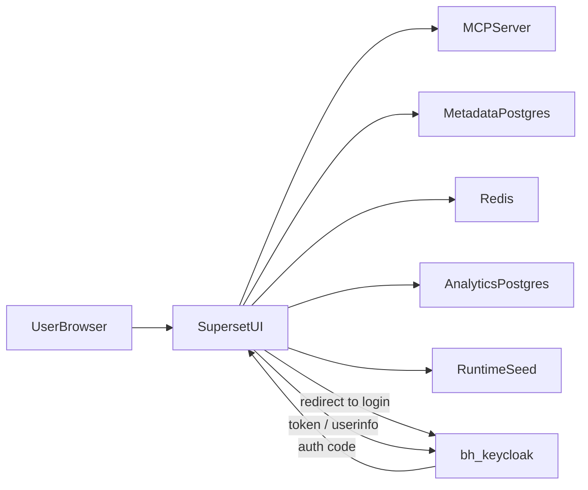
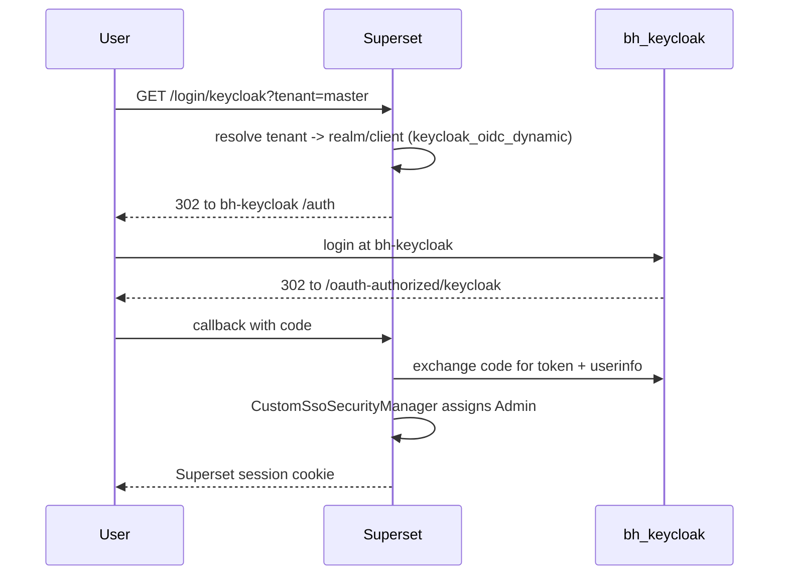
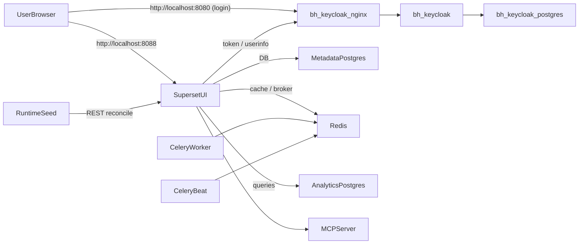
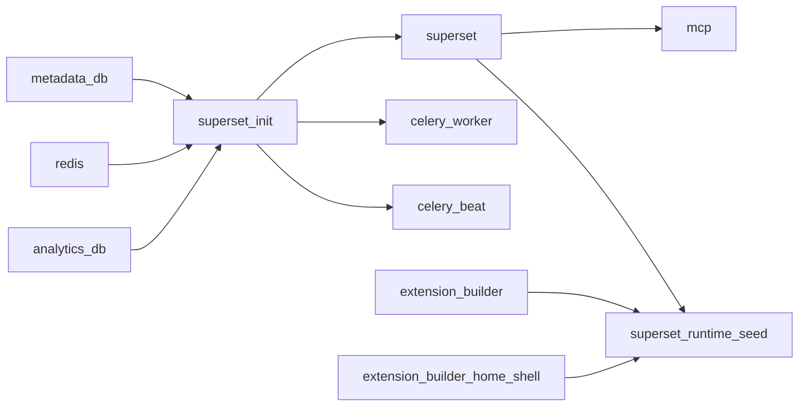
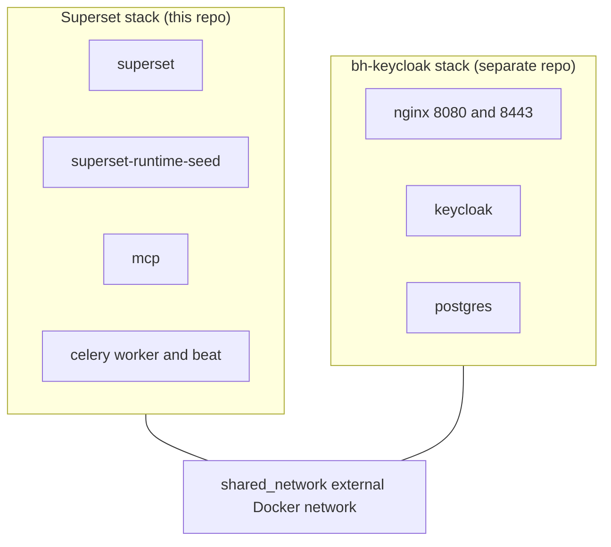

# Architecture

This page describes the runtime topology of the Superset Control Plane after the external `bh-keycloak` cutover.

## At a glance

### Architecture overview

### Login sequence

The detailed runtime topology, network attachments, and startup ordering follow.

## Service map

| Service | Image | Role |
|---|---|---|
| `superset` | `apache-superset-1-superset:local` | Web UI / API |
| `superset-init` | same image | One-shot DB migrate, init, admin user |
| `celery-worker` | same image | Async tasks |
| `celery-beat` | same image | Scheduled tasks (alerts, cache, prune) |
| `mcp` | same image | MCP server (`superset mcp run`) |
| `superset-runtime-seed` | same image | Continuous reconciler from `assets/` |
| `metadata-db` | `postgres:18-alpine` | Superset metadata Postgres |
| `analytics-db` | `postgres:18-alpine` | Sample analytics Postgres (LFS-seeded) |
| `redis` | `redis:8-alpine` | Celery broker + cache |
| `extension-builder` | local builder | Builds the `dashboard-chatbot` `.supx` |
| `extension-builder-home-shell` | local builder | Builds the `home-shell` `.supx` |

External dependency (provided by the `bh-keycloak` repo):

- `bh-keycloak-keycloak-1` (Keycloak server)
- `bh-keycloak-nginx-1` (TLS reverse proxy in front of Keycloak)
- `bh-keycloak-postgres-1` (Keycloak DB)

## Networks

| Network | Driver | Purpose |
|---|---|---|
| `superset-net` | bridge (project-scoped) | Internal Superset wiring |
| `bh-keycloak-net` | external (`shared_network`) | Reach `bh-keycloak` containers by hostname |

Every Superset runtime service is attached to both networks so Keycloak hostnames (`nginx`, `keycloak`) resolve from inside the Superset containers.

## Topology diagram

## Startup order

`superset-init` no longer waits on a Keycloak bootstrap — there is no embedded Keycloak in this stack. Auth is verified at request time against external `bh-keycloak`.

## Build pipeline

- The `superset` service is the canonical builder for the image tag `apache-superset-1-superset:local`.
- All other services that need this image use `image:` + `pull_policy: never` to avoid parallel rebuilds.
- The `frontend-builder` Docker stage compiles custom viz plugins from `superset-plugins/` into the SPA bundle. There is no runtime plugin loader (`FEATURE_FLAGS["DYNAMIC_PLUGINS"] = False`).

## External boundary

The Superset stack does not own the IdP lifecycle. Bringing `bh-keycloak` up/down is independent of `docker compose up` here.
