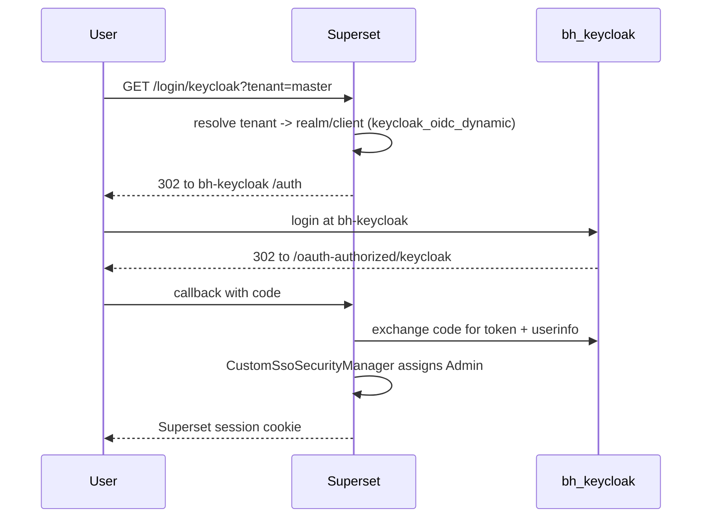

# Identity and Auth

Superset delegates authentication to the external **`bh-keycloak`** stack. This page documents the env contract, login flow, dynamic per-tenant resolution, and the current access policy.

## Components

| Component | File | Purpose |
|---|---|---|
| OAuth provider config | [`superset_config.py`](../../superset_config.py) | Builds the FAB `OAUTH_PROVIDERS` entry for `keycloak` |
| Custom security manager | [`custom_sso_security_manager.py`](../../custom_sso_security_manager.py) | Subclasses `SupersetSecurityManager`, extracts userinfo, assigns roles |
| Dynamic OIDC view | [`keycloak_oidc_dynamic.py`](../../keycloak_oidc_dynamic.py) | Resolves tenant per request, patches the OAuth client to that realm/client |

All three are mounted into the Superset image at runtime under `/app/pythonpath/` (see compose volumes).

## Env contract

| Variable | Used by | Notes |
|---|---|---|
| `KEYCLOAK_SERVER_URL` | Browser | Authorize redirect target (e.g., `http://localhost:8080`) |
| `KEYCLOAK_API_BASE_URL` | Container | Token / userinfo / JWKS calls (e.g., `http://nginx:8080`) |
| `KEYCLOAK_REALM` | Static-mode + fallback | Only required when dynamic mode is off |
| `KEYCLOAK_CLIENT_ID` | OIDC client | Must match a client registered in the realm |
| `KEYCLOAK_CLIENT_SECRET` | OIDC client | Empty for public clients |
| `KEYCLOAK_REDIRECT_URI` | Optional | Pinned callback URL; defaults to `/oauth-authorized/keycloak` |
| `KEYCLOAK_ROLE_CLAIM` | Userinfo parsing | Token claim that carries Superset role keys |
| `KEYCLOAK_DYNAMIC_TENANTS` | Resolver mode | Default `true`. Set false/0/no/off for single-realm mode |
| `KEYCLOAK_TENANT_RESOLVERS` | Resolver order | Default `query,header,subdomain,cookie,fallback` |
| `KEYCLOAK_TENANT_QUERY_PARAM` | Query resolver | Default `tenant` |
| `KEYCLOAK_TENANT_HEADER` | Header resolver | Default `X-Tenant-Key` |
| `KEYCLOAK_TENANT_SUBDOMAIN_BASE_HOST` | Subdomain resolver | e.g., `app.example.com` → `tenantA.app.example.com` |
| `KEYCLOAK_TENANT_COOKIE_NAME` | Cookie resolver | Default `tenant_key` |
| `KEYCLOAK_DEFAULT_TENANT_KEY` | Fallback | Used if all other resolvers miss |
| `KEYCLOAK_TENANT_REQUIRED` | Resolver | Default `true`. If true, login fails fast when no tenant resolves |
| `KEYCLOAK_TENANT_REGISTRY_JSON` | Registry | Optional JSON file mapping tenant key → OIDC config |
| `KEYCLOAK_TENANT_REGISTRY_URL` | Registry | Optional HTTP registry, supports `{tenant_key}` template |
| `KEYCLOAK_EXTERNAL_NETWORK` | Compose | External Docker network to join (default `shared_network`) |

URLs may be host-root or full realm/OIDC URLs. They are normalized in `keycloak_oidc_dynamic.normalize_keycloak_base()` so accidental `/realms/.../protocol/openid-connect` suffixes do not double up.

## Login sequence



## Tenant resolver order

`keycloak_oidc_dynamic.resolve_tenant_key_from_request()` walks resolvers in this order (configurable via `KEYCLOAK_TENANT_RESOLVERS`):

1. `query` — `?tenant=<key>`
2. `header` — `X-Tenant-Key: <key>`
3. `subdomain` — `<key>.<KEYCLOAK_TENANT_SUBDOMAIN_BASE_HOST>`
4. `cookie` — `tenant_key=<key>`
5. `fallback` — `KEYCLOAK_DEFAULT_TENANT_KEY` then `KEYCLOAK_REALM`

If none match and `KEYCLOAK_TENANT_REQUIRED=true`, the user is redirected back to the login page with a flash message instead of a generic OAuth error.

## Per-tenant client patching

For each request that resolves a tenant, `apply_keycloak_remote_patch()` rewrites the FAB OAuth client in place:

- `client_id` / `client_secret` — from registry entry or env
- `authorize_url` — `<browser_base>/realms/<realm>/protocol/openid-connect/auth`
- `access_token_url` — `<internal_base>/realms/<realm>/protocol/openid-connect/token`
- `api_base_url` — `<internal_base>/realms/<realm>/protocol/openid-connect`
- `redirect_uri` — from registry entry if provided

The resolved blob is also stashed in `session[SESSION_KEY]` so the callback handler (`/oauth-authorized/<provider>`) can re-apply the patch on the return leg.

## Access policy (intentional)

`CustomSsoSecurityManager._oauth_calculate_user_roles` returns Superset `Admin` for **every** Keycloak-authenticated user:

```python
def _oauth_calculate_user_roles(self, userinfo) -> List[Role]:
    """Every Keycloak sign-in gets Superset Admin (ignores Keycloak role mappings)."""
    admin = self.find_role("Admin")
    if admin:
        return [admin]
    return super()._oauth_calculate_user_roles(userinfo)
```

This is by design for the current single-organization-per-tenant model. To support narrower roles, reintroduce `AUTH_ROLES_MAPPING` and remove the override.

## Onboarding a new tenant realm

When `bh-keycloak` adds a new tenant realm (say `acme`):

1. In that realm, create or reuse an OIDC client (e.g., `bighammer-admin` or a dedicated `superset` client).
2. Add Superset's redirect URI to the client's **Valid Redirect URIs**:

   ```text
   http://localhost:8088/oauth-authorized/keycloak
   ```

   For local dev, the looser pattern `http://localhost:8088/*` also works.

3. (Optional) Add a registry entry so Superset can resolve realm/client from a tenant key. Example `KEYCLOAK_TENANT_REGISTRY_JSON`:

   ```json
   {
     "acme": {
       "realm": "acme",
       "client_id": "superset",
       "client_secret": ""
     }
   }
   ```

4. Verify the login flow:

   ```bash
   curl -s -o /dev/null -w "%{http_code} %{redirect_url}\n" \
     "http://localhost:8088/login/keycloak?tenant=acme"
   ```

   Expect a `302` to `<KEYCLOAK_SERVER_URL>/realms/acme/protocol/openid-connect/auth?...`.

## Notes for `bh-keycloak` operators

- The `bh-keycloak` startup script `keycloak/keycloak_setup.sh` reads `KEYCLOAK_REDIRECT_URIS` from that repo's `.env`, then **deletes and recreates** the `bighammer-admin` client (and user) on every container start. So updating `.env` and restarting the container will reapply the redirect list — but it also resets the user password to the script's default.
- Patching the live client without a restart is safer if you only want to add a redirect URI:
  ```bash
  CID=$(docker exec bh-keycloak-keycloak-1 /opt/keycloak/bin/kcadm.sh get clients -r master \
    -q clientId=bighammer-admin --fields id --format csv --noquotes | tail -n1)
  docker exec bh-keycloak-keycloak-1 /opt/keycloak/bin/kcadm.sh update "clients/$CID" -r master \
    -s 'redirectUris=["http://localhost:8080/*","http://localhost:5001/*","https://localhost:8443/*","http://localhost:8088/*"]'
  ```

## MCP auth (separate)

The MCP server has its own auth knobs (`MCP_AUTH_ENABLED`, `MCP_JWT_*`, `MCP_JWKS_URI`). They are independent of the browser OAuth flow above. See `superset_config.py` for defaults.
